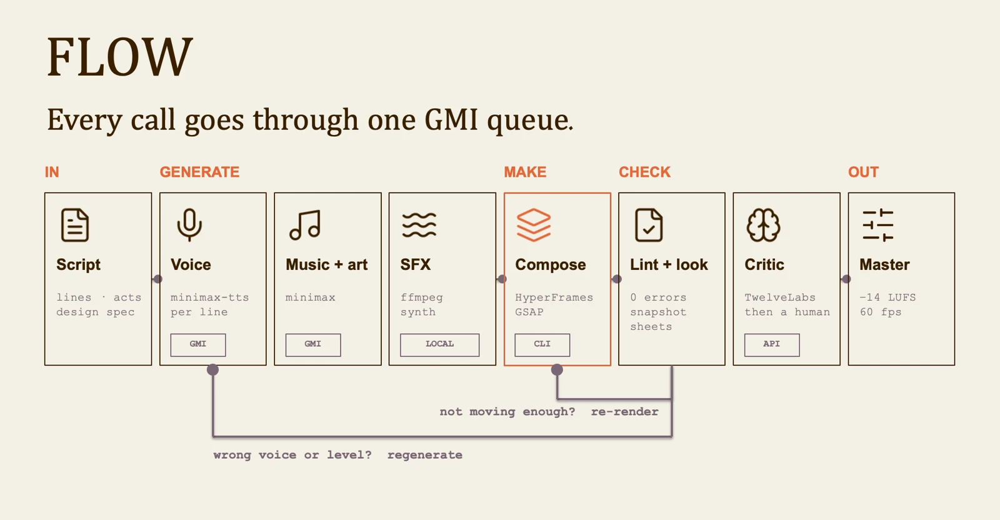
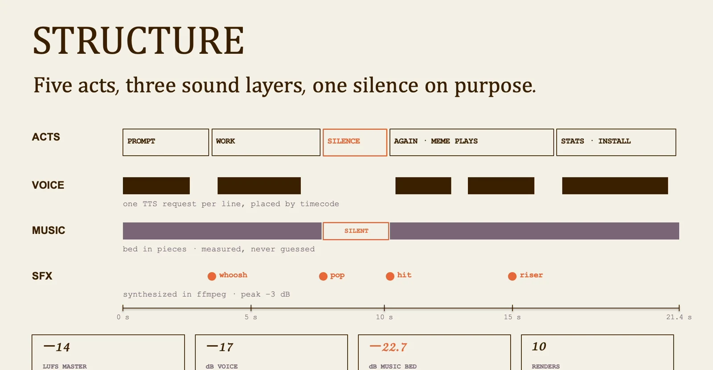

# Hybrid filmmaking: lesson 10

Plan the message and timing before animating. The class connects a spoken narrative to a controlled sequence of scenes, graphics and sound.

## Workflow

1. Script
2. Voice
3. Art + sound
4. Compose
5. Check
6. Mix + render

## Let the voice set the timing

Approve the script and voice before timing the scenes. Place music, artwork and sound effects around that structure, then compose the motion. Check layouts and sample frames before a full render. When the critic finds a problem, change the relevant scene and inspect it again.

## Give each layer a distinct role

Use the voice to explain, the image to demonstrate and motion to direct attention. Music supports the pace; sound effects should mark meaningful events. Leave space around important words and transitions. If every layer demands attention at once, simplify the scene before adding more animation.

Visuals from the original class presentation. Tool names reflect the recorded class.
