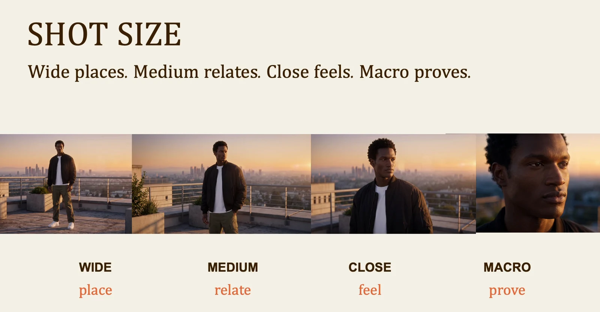
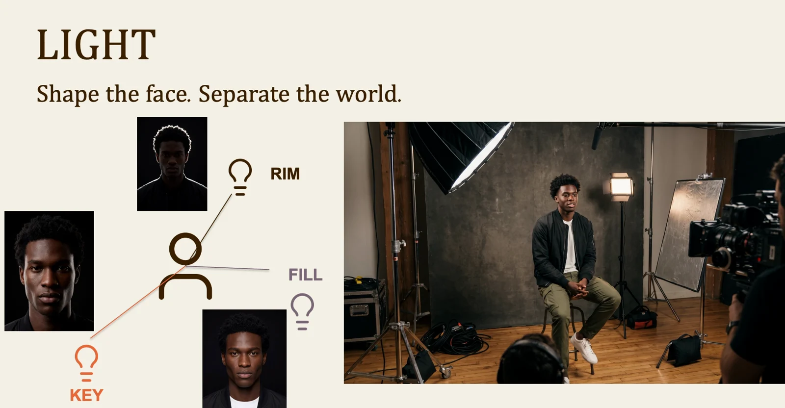

# Hybrid filmmaking: lesson 2

Turn the brief into visible decisions. These foundations apply whether you record the image, generate it, or combine both.

## Workflow

1. Brief
2. Shot list
3. Frame and light
4. Record
5. Edit
6. Deliver

## Choose the shot for its job

A wide shot establishes the place. A medium shot connects a person to the action. A close shot emphasizes a reaction. A detail shot gives the viewer evidence. Build a short sequence that answers where, who and what matters, instead of changing the framing only for variety.

## Shape the subject with light

The key light gives the subject shape. Fill controls how much detail remains in the shadows. A rim light separates the subject from the background. Start with the key, inspect the face, then add only what the image needs. Keep the lighting direction consistent when you generate matching shots.

Visuals from the original class presentation. Tool names reflect the recorded class.
