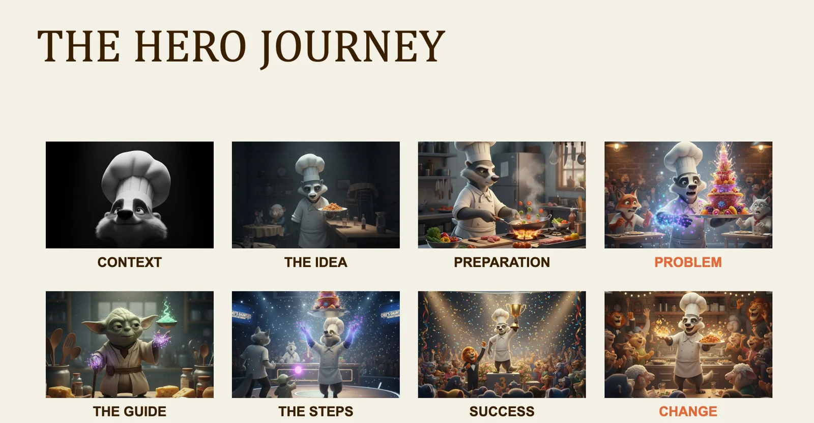
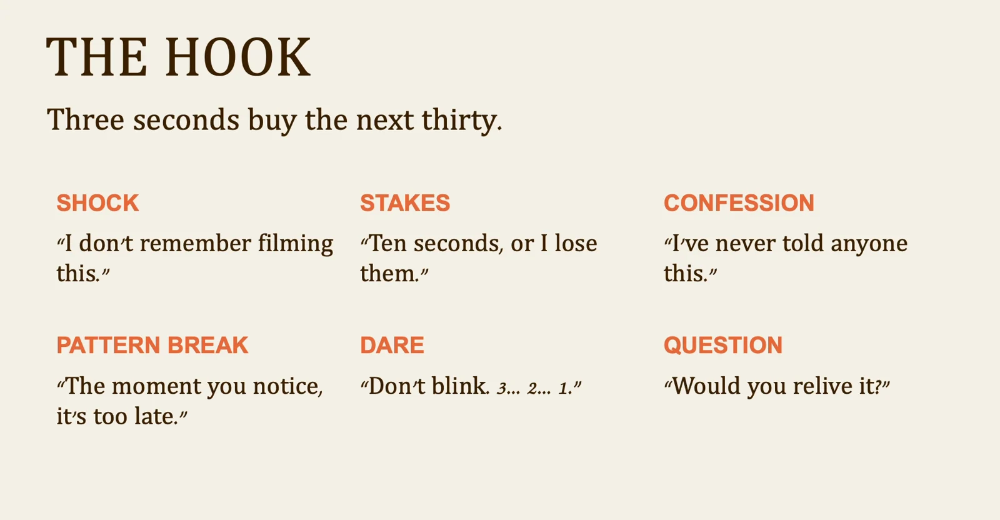

# Hybrid filmmaking: lesson 3

A script gives every shot a purpose. Use the structure below to decide what the audience needs to understand and what they should do next.

## Workflow

1. Character
2. Problem
3. Plan
4. Action
5. Result

## Make the change visible

Start with a person in a specific situation and a problem the viewer can recognize. Show the guide or idea that makes action possible, then the steps and their result. The ending should demonstrate a change. For a short client film, combine beats without losing the connection between the problem and the outcome.

## Give the opening a clear promise

Choose an opening that raises a question the film can answer. A surprising result, a recognizable frustration or a concrete demonstration can earn attention. Write the final payoff before polishing the hook so the opening promises something the footage can actually deliver.

Visuals from the original class presentation. Tool names reflect the recorded class.
