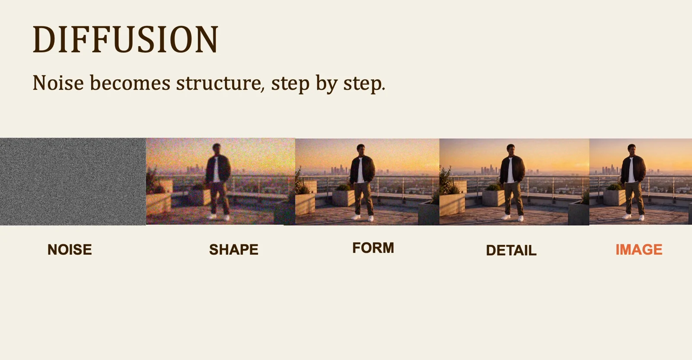
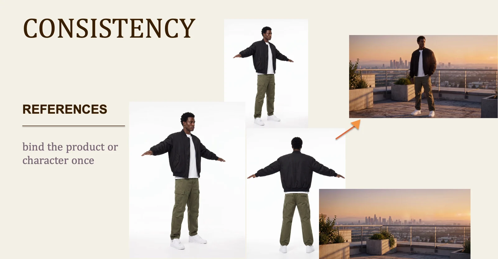

# Hybrid filmmaking: lesson 4

Use AI where it serves the shot. Decide what must remain real, what can be generated and what needs to stay consistent across both.

## Workflow

1. Brief
2. Reference
3. Generate
4. Compare
5. Animate

## From noise to an image

The class visualizes generation as progressive refinement. Your prompt and references guide the result, but they do not guarantee exact details. Describe the subject, framing and light, then inspect the output against the brief. Treat the first image as a candidate to review before spending time animating it.

## Carry a reference through the sequence

Approve a reference before generating a sequence. Keep the same subject description, wardrobe, palette and light direction in later requests. Compare every new shot to that reference. If identity or product geometry drifts, fix the image first so the error does not spread into video.

Visuals from the original class presentation. Tool names reflect the recorded class.
