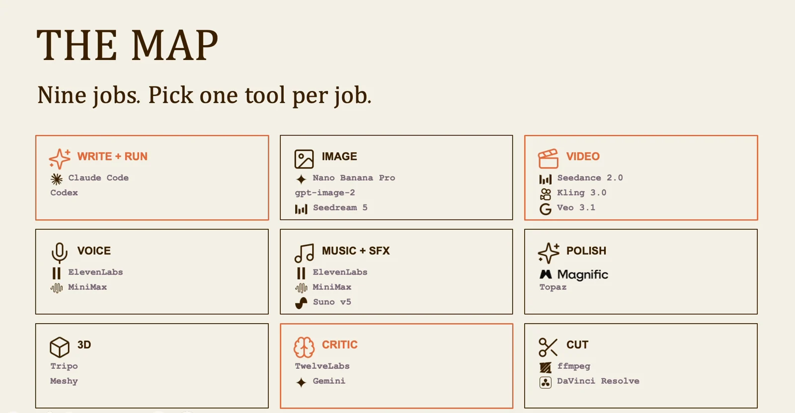
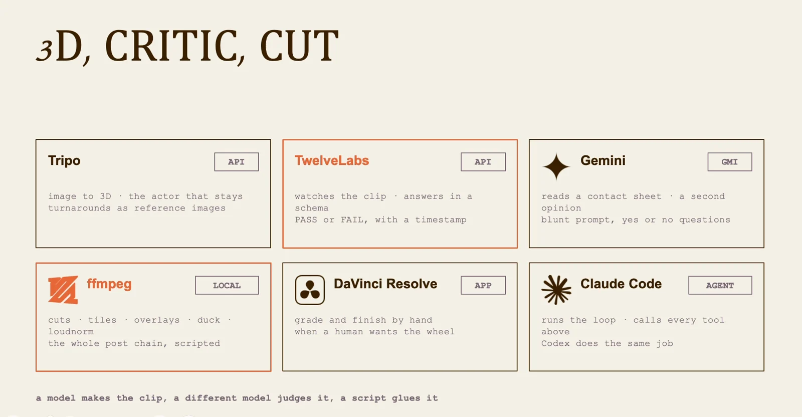

# Hybrid filmmaking: lesson 5

Build the smallest tool set that can deliver the brief. The map helps you separate production jobs from product names.

## Workflow

1. Identify the job
2. Test one output
3. Check the handoff
4. Choose the tool

## Choose by production task

Break the job into writing, image creation, video, voice, music, editing and review before choosing tools. Assign one tool to each task you actually need. The names in the slide document the class setup. Check current capabilities and pricing before using the same setup for a client.

## Connect the output to the next step

A tool is useful when its output can be checked and handed to the next stage. Confirm the file format, resolution, timing information and editing requirements before running a large batch. Test one representative shot through the complete workflow, including the final export.

Visuals from the original class presentation. Tool names reflect the recorded class.
