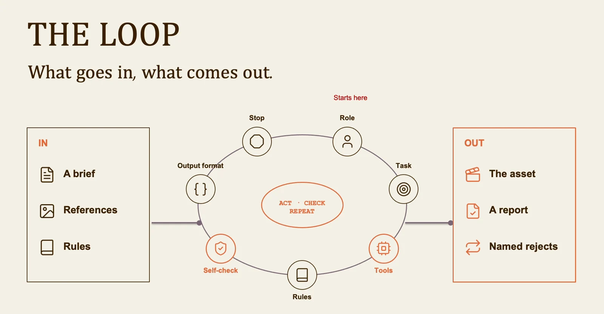
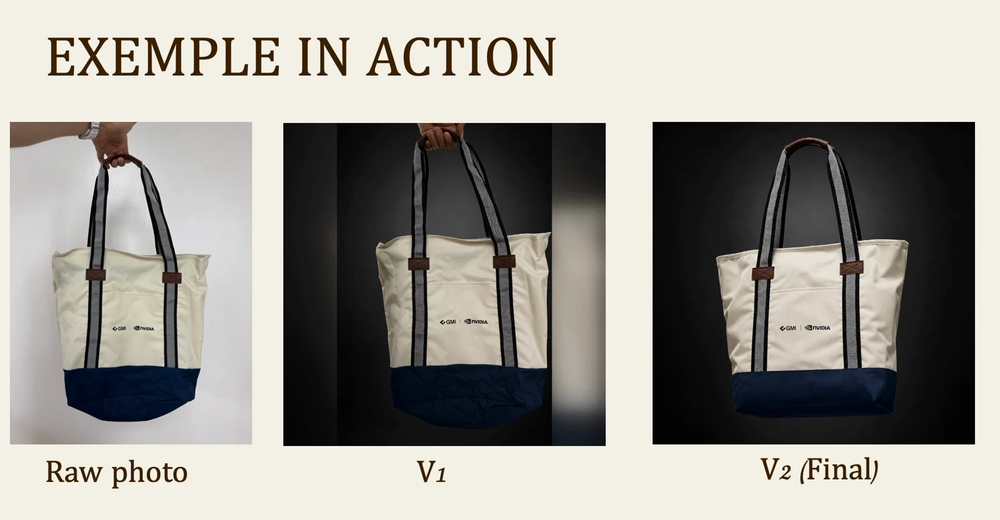

# Hybrid filmmaking: lesson 6

An agent needs more than a prompt. It needs tools, rules, a way to inspect its work and a condition for stopping.

## Workflow

1. Inputs
2. Act
3. Inspect
4. Revise
5. Approve

## Read the loop, including the way back

Give the agent the brief, references, available tools and a clear output. After each action, compare the result to explicit checks. A failed check should send the work back to the stage that caused it. Set a revision limit and keep human approval at the final delivery step.

## Compare revisions against the same target

Keep the original and each revision visible together. Name the specific defect before asking for another attempt: framing, identity, color or an unwanted object. Preserve the parts that already pass. A revision should solve the stated problem without quietly introducing a new one.

Visuals from the original class presentation. Tool names reflect the recorded class.
