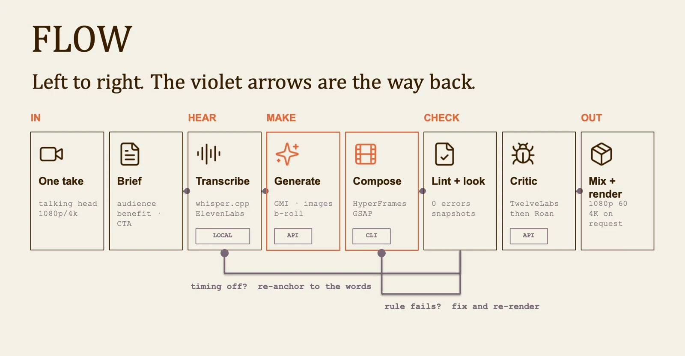
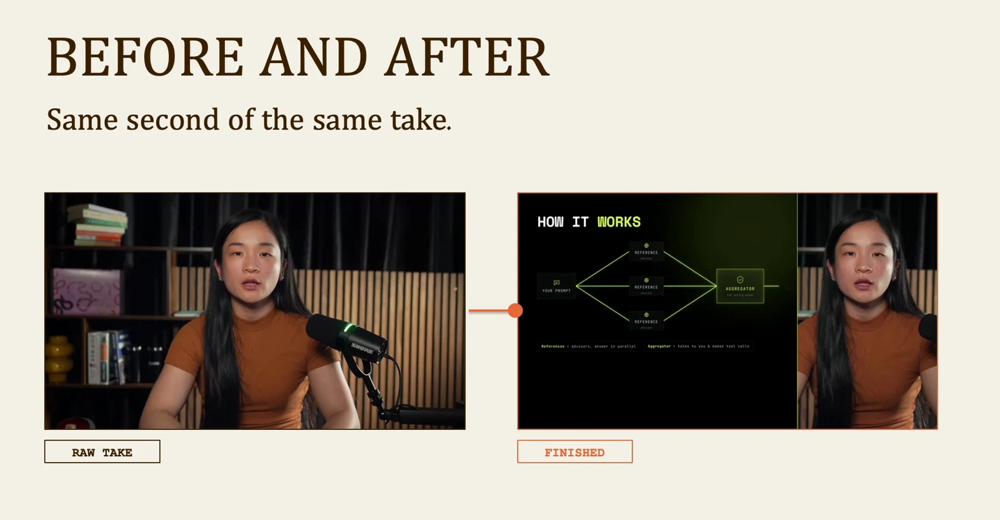

# Hybrid filmmaking: lesson 7

Start with a clear recording. The production kit helps turn that take into a tutorial with useful graphics, precise timing and a checked export.

## Workflow

1. Take + brief
2. Transcribe
3. Compose
4. Check
5. Revise
6. Render

## Build around the spoken words

Transcribe the take before placing graphics. Anchor each overlay to the words it explains, then compose the footage, graphics and supporting images. If timing fails, return to the transcript anchors. If a visual rule fails, fix the composition and inspect new frames before rendering again.

## Keep the presenter and the proof readable

Use the presenter as the continuous explanation and add a visual only when it helps the viewer understand a step. Leave faces and interface controls readable. Watch once without sound to check visual clarity, then listen without watching to check whether the explanation still makes sense.

Visuals from the original class presentation. Tool names reflect the recorded class.
