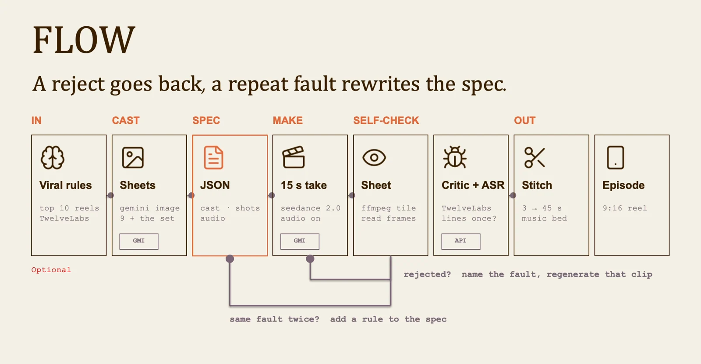
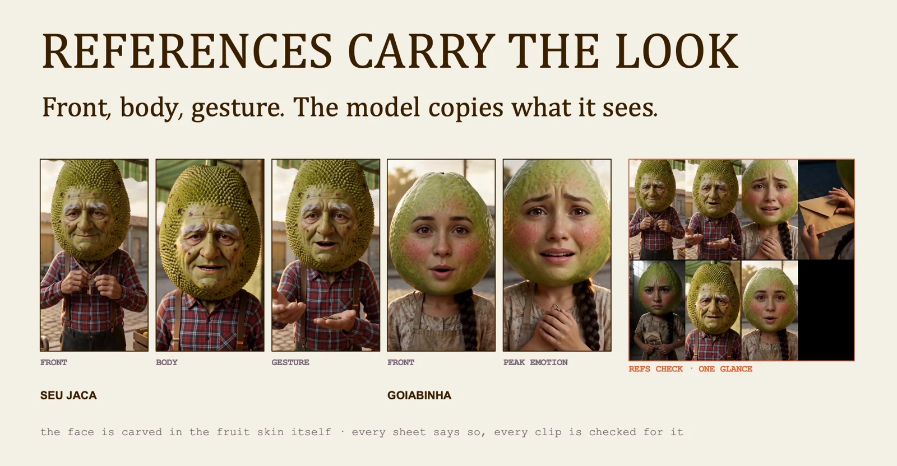

# Hybrid filmmaking: lesson 8

A recurring cast needs a repeatable visual reference. The workflow protects character identity while the story and camera change.

## Workflow

1. Story rules
2. Cast sheets
3. Shot plan
4. Generate
5. Check
6. Assemble

## Approve the cast before generating scenes

Write the episode beats and approve the character sheets first. Generate the shots from those shared references, then review each clip for identity, action and continuity. Reject a failing shot before stitching the episode. Keep the accepted references for the next episode.

## Use a character sheet as the shared reference

Record the details that identify each character: proportions, clothing, colors and distinguishing features. Use front and full-body views to make those details explicit. When a new shot changes one of them, correct it against the sheet instead of redefining the character in the next prompt.

Visuals from the original class presentation. Tool names reflect the recorded class.
