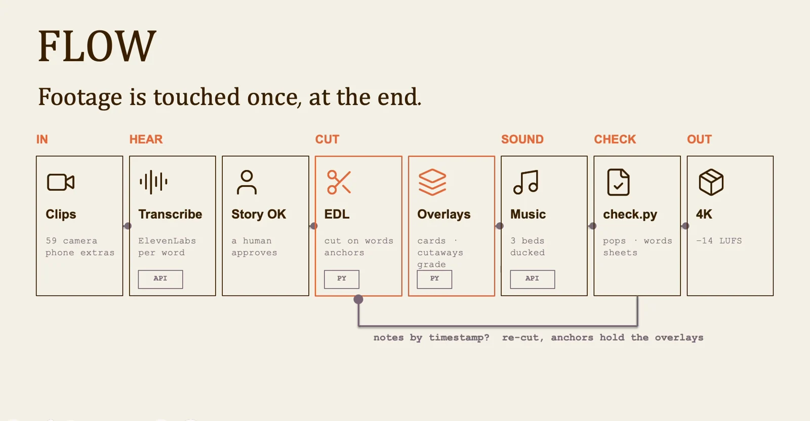
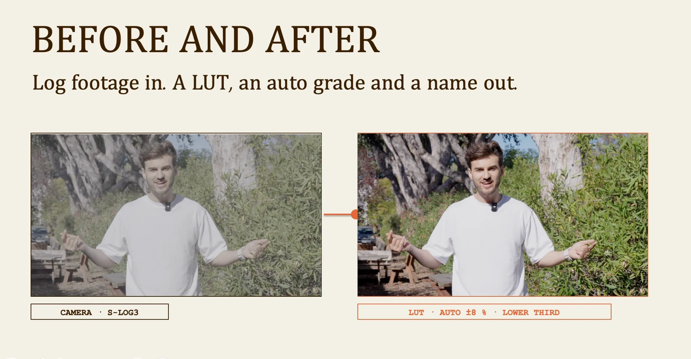

# Hybrid filmmaking: lesson 9

Let the recorded material lead. Use AI to help find, organize and package the story while keeping control of the edit.

## Workflow

1. Footage
2. Transcript
3. Story approval
4. Edit
5. Finish
6. Review

## Lock the story before decorating the cut

Inventory the footage, transcribe speech and propose a story from material that actually exists. Approve the selects and sequence before adding overlays, music or effects. Keep the edit decisions traceable to source clips so a client revision can change one section without rebuilding the whole film.

## Finish the footage with a consistent treatment

Balance exposure and color across adjacent shots before applying a look. Add labels only where they identify something useful, then check contrast and safe placement. Listen for abrupt level changes between dialogue and music, and review the exported file rather than relying only on the timeline.

Visuals from the original class presentation. Tool names reflect the recorded class.
